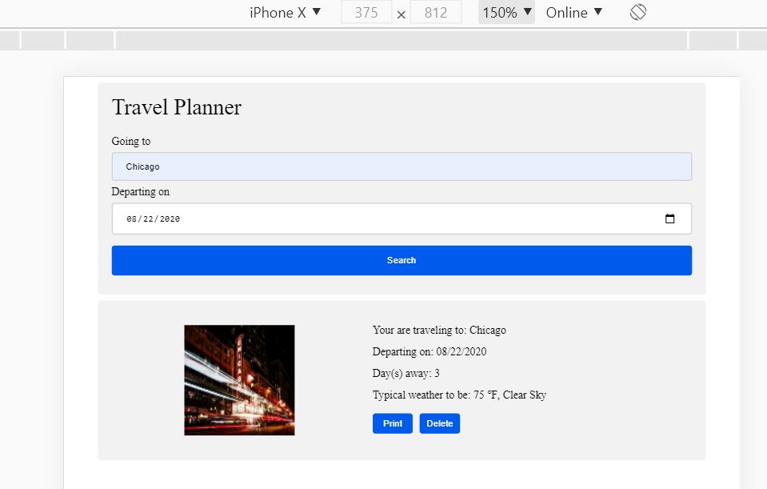

# Travel App

## Overview

This project obtains a desired trip location & date from the user, and displays weather and an image of the location using information obtained from external APIs.

## Result

## APIs included

* [Geonames](http://www.geonames.org/export/web-services.html)
* [Weatherbit](https://www.weatherbit.io)
* [Pixaby](https://pixabay.com/api/docs/)

## Development Strategy

1. Get webpack set up to work with this project. 
2. Create webpage content `src/client/views/index.html`
3. Create `src/client/js/app.js` to handle user submittion, pull data from APIs and populate `index.html`
4. Create test scripts in `__tests__` to test client and server sides

## Instructions

1. `npm install`
2. `npm run build-prod`
3. `npm run build-dev`